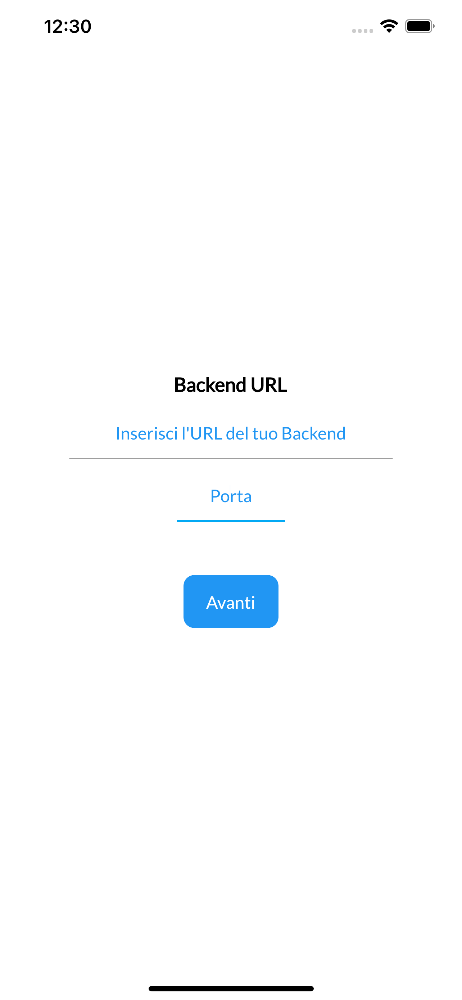
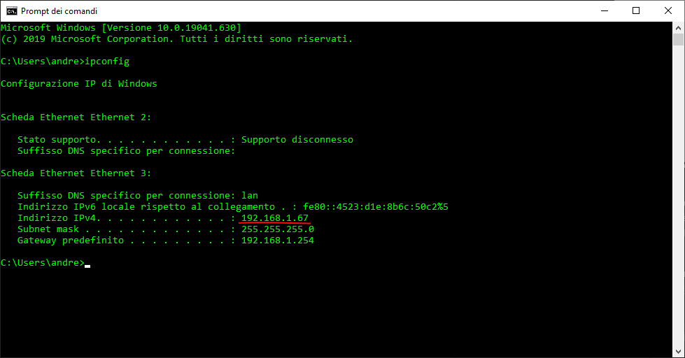

# Progetto finale

Come progetto finale, utilizzando [Spring framework](https://spring.io/), dovrete realizzare il lato backend di un'app Android da noi realizzata e consegnata a voi; questo applicativo è un gestionale di prenotazioni per evitare assembramenti in tempi di covid-19. Gli utenti possono registrarsi alla piattaforma, creare eventi, vedere gli eventi disponibili, iscriversi ad eventi, cancellarsi da eventi e vedere a quali eventi ci si è iscritti.

L'applicativo ha tutto ciò che gli serve lato frontend ma per poter funzionare ha bisogno degli endpoint del backend con cui interagire
## Endpoint backend

Tipo | Nome | Tipo Input | Input | Output | URI | Codice HTTP |Descrizione
------------|--------|--------|-------------|-------------|----------|--------|----------|
POST | signUpUser | Body Json | User { username, password, name, surname, gender, birthDate} | User | /user | 201 |Registra un utente alla piattaforma
GET | logIn | QueryString | [username, password] | User | /login?username={username}&password={password} | 200 | Verifica la corrispondenza di email e password e restituisce l'utente corrispondente
GET | getActiveEvents | | | List\<Event> | /events | 200 |Restituisce gli eventi disponibili a cui l'utente può registrarsi
POST | joinEvent | PathParam | [eventid] | Event | /join/{eventid} | 201 | Registra l'utente ad un evento
POST | unjoinEvent | PathParam | [eventid] | Event | /unjoin/{eventid} | 201 | Annulla la registrazione dell'utente ad un evento
POST | createEvent | Body Json | Event {name, capacity, place, date} | Event | /event | 201 | Crea un evento sulla piattaforma
GET | getEventDetails | PathParam | [eventid] | Event | /event/{eventid} | 200 | Restituisce le informazioni dettagliate di un evento.
DELETE | cancelEvent | PathParam | [eventid] | Event | /event/{eventid} | 200 | Permette **solo** al creatore di un evento di annullarlo.
GET | getUserEvents | | | List\<Event> | /user/events | 200 | Restituisce una lista con gli eventi creati dall'utente e quelli a cui ha partecipato. Solo gli eventi futuri, non quelli passati

Questi endpoint inviano e ricevono i dati sotto forma di Json e la sessione con l'utente è gestita tramite cookie.\
Tutti gli endpoint devono far uso del cookie per capire da quale utente sta arrivando la request, questo cookie viene settata dal backend quando l'utente si logga e si slogga dal servizio.

&nbsp;
## Uno User è caratterizzato dai seguenti campi:

Campo | Tipo | Descrizione
------------ |-------- |-------------
username | String | Un sopranome univoco scelto dall'utente
name | String | Nome dell'utente
surname | String | Cognome dell'utente
birthDate | Date | Data di nascita
gender | Enum | [male, female, other]
password | String | Password dell'utente (Presente soltanto nella chiamata di registrazione dell'utente)

&nbsp;
## Un Event è caratterizzato dai seguenti campi:

Campo | Tipo | Descrizione
------------ |-------- |-------------
eventid | UUID | ID univoco dell'evento
owned | Boolean | sopranome del creatore dell'evento
name | String | Nome dell'evento
date | Timestamp | Data e ora di quando si svolgerà l'evento
place | String | Dove si svolgerà l'evento
capacity | Integer | Quante persone può accogliere l'evento
&nbsp;

La date sono inviate sotto forma di stringa con il seguente formato: yyyy-MM-dd
Un time stamp è una data che ha anche un orario ed è nel formtato: yyyy-MM-ddThh:mm:ss

&nbsp;
## Ci sono una serie di requisiti che l'applicativo deve rispettare:

* Un utente non può creare un evento per una data passata.
* Non possono esistere due utenti con lo stesso username.
* Solo il creatore di un evento può annullarlo
* Un utente non può iscriversi ad un evento dove è stato raggiunto il tetto massimo di iscritti o l'evento è passato.
* Un utente che crea un evento automaticamente è un partecipante dell'evento

Il backend da voi realizzato dovrà esporre gli endpoint elencati come APIREST; per quanto riguarda i dati questi dovranno essere salvati su un database SQL. **Evitate di salvare le password in chiaro nel database.**

## Connessione al server dall'app

In questa schermata dovrete inserire l'ip del server dove girerà il vostro applicativo e la porta da dove il vostro applicativo sarà in ascolto di nuove connessioni. Il server può tranquillamente essere il vostro computer su cui sviluppate il codice; se avete un ip visibible dall'esterno inserite quello altrimenti vi basterà connettere il telefono al vostro Wifi di casa e dargli come ip quello della rete interna del vostro computer, 

### Come scopro il mio ip interno?

Scoprire l'ip interno del proprio computer è semplicissimo, su windows vi basta aprire il prompt dei comandi e digitare il comando "ipconfig":

L'indirizzo sottolineato in rosso è l'indirizzo ip del vostro computer nella vostra rete interna.

### E quello esterno?

Il modo più rapido per scoprire il vostro ip esterno è quello di andare in siti internet come [questo](https://www.myexternalip.com/). Fate attenzione che se il vostro ip è nascosto dietro [una rete NAT](https://www.fastweb.it/internet/cos-e-il-nat-e-come-funziona/) (potrebbe succedere se siete utenti fastweb) potreste non vedere il vostro ip esterno ma quello della rete NAT di cui fate parte. Un'altra cosa di cui fare attenzione in caso di utilizzo di ip esterno è che il vostro router potrebbe bloccare (per questioni di sicurezza) la porta su cui il server è in ascolto e in questo caso bisogna nei settaggi del router autorizzare la porta a ricevere dati. 

Il nostro consiglio è quello di non perdere tempo con l'ip esterno ma di **utilizzare il vostro ip interno** poiché è sicuramente più semplice e immediato. L'utilizzo dell'ip esterno vi da soltanto il vantaggio di poter utilizzare l'app da fuori casa, durante la fase di sviluppo questo vantaggio è totalmente inutile, vale la pena prendere in considerazione l'ip esterno una volta abbiate terminato di sviluppare il progetto per poterlo mostrare anche fuori casa.