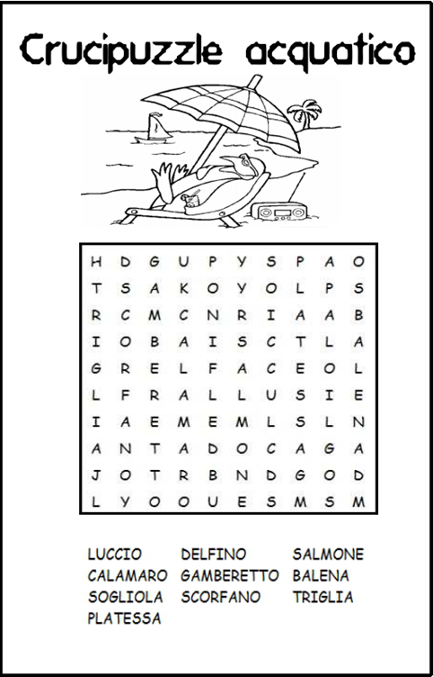

# CruciPuzzle

* Scrivete una funzione che prende in input una matrice di caratteri e una parola e restituisce true se la parola si trova all’interno della matrice sia verticalmente che orizzontalmente, false altrimenti.
* Fatto questo fate in modo che il programma controlli anche se la parola è scritta al contrario
* Bonus stage: controllate anche se la parola è presente in diagonale!

## :wink: Suggerimenti:
* Scrivetevi una funzione che stampa a schermo la matrice
* Quando trovate una parola stampatevi gli indici della prima lettera
