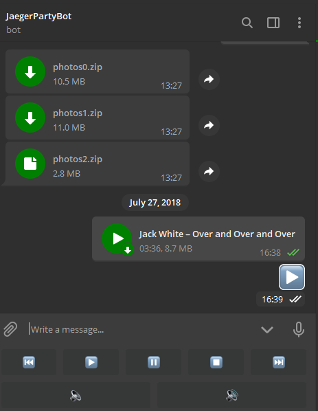

# Telegram bots


Oggi imparerete a programmare [bot telegram](https://core.telegram.org/bots)!


## Come funziona un bot?

Un bot telegram non è altro che un software che scarica i messaggi che riceve da telegram e può rispondere. Generalmente un bot risiede su un server ma può tranquillamente essere eseguito sulle vostre macchine.

<p align="center">

</p>

Per scrivere un bot bisogna interagire con le [API messe a disposizione da Telegram](https://core.telegram.org/bots). Questo significa che possiamo realizzare il nostro bot nel linguaggio di programmazione che vogliamo, l'importante è che il linguaggio ci dia la possibilità di poter utilizzare la rete. Per rendere semplice e immediato l'utilizzo di queste API, sviluppatori di tutto il mondo hanno creato framework e Wrapper per rendere facile la vita agli altri sviluppatori in modo così che potessero concentrarsi sull'implementazione del bot senza soffermarsi su molti aspetti tecnici. in [questa pagina](https://core.telegram.org/bots/samples) una selezione di questi prodotti divisa per linguaggio, per la lezione di oggi utilizzeremo [Botticelli](https://github.com/Jaeger87/Botticelli), un framework Java realizzato da [Jaeger87](https://github.com/Jaeger87).

## Creazione di un bot

Prima di iniziare a programmare il nostro bot, dobbiamo prima chiedere il permesso a Telegram per crearlo. Per farlo dovremmo interagire con un loro bot, il [botFather](https://telegram.me/BotFather).

<p align="center">

</p>

Contattate quindi con il vostro account telegram il botFather, dategli il comando "/newbot" e seguite la procedura guidata per creare il vostro bot (dandogli un nome e un nickname che deve finire con "bot"). Quando la procedura sarà conclusa riceverete un token

# ATTENZIONE

Il token è univoco e legato al vostro account e al vostro bot, non dovete assolutamente condividerlo e fate attenzione a non caricarlo nella vostra repository personale (vi ricordate il **git ignore**? Ecco, usatelo!)


## Partiamo

Una volta creato il bot, scaricate il paccheto zip [IlMioPrimoBot.zip](https://github.com/Jaeger87/CorsoTree2020/tree/master/module_07/Telegram/IlMioPrimoBot.zip), decomprimetelo e nel file token.txt inserite il vostro **token segreto**, in questa maniera se volete caricare il progetto su github vi basterà inserire nel git.ignore il file token.txt.

All'interno del progetto troverete due classi, la classe Main che contiene il main del progetto e la classe PrimoBot.java in cui risiede il bot. 


## Classe Main

In questa classe abbiamo solo il metodo main che legge il file Token per ottenere il token sotto forma di stringa per poi utilizzarlo per inizializzare la classe bot


```java
        Bot bot = new PrimoBot(token);
        MessageReceiver mr = new MessageReceiver(bot, 500, 1);
        mr.ignoreEditedMessages();
        mr.start();
```

Cambiando il tipo di classe del bot cambierà il comportamento del vostro bot, perciò per testare gli esercizi vi basterà ogni volta cambiare PrimoBot con una diversa classe che estende Bot e il gioco è fatto. **NON TOCCATE GLI ALTRI PARAMETRI.** 

## Classe Bot

La classe PrimoBot è un esempio di classe Bot che però al momento non fa nulla. Dentro questa classe però troverete diversi metodi vuoti:

```java
    public class PrimoBot extends Bot {

    public PrimoBot(String token)
    {
        super(token);
    }

    @Override
    public void textMessage(Message message) {
    }

    @Override
    public void audioMessage(Message message) {

    }

    @Override
    public void videoMessage(Message message) {

    }

    @Override
    public void voiceMessage(Message message) {

    }

    @Override
    public void stickerMessage(Message message) {

    }
```
E molti altri!

Questi metodi rappresentano i tipi di messaggio che vi possono arrivare, perciò per esempio quando arriva un messaggio di testo viene chiamato il metodo textMessage(Message message) e quando invece arriva uno sticker al bot viene chiamato il messaggio public void stickerMessage(Message message). L'oggetto Message non è altro che la conversione 1 a 1 di [questo oggetto](https://core.telegram.org/bots/api#message) che invia Telegram; perciò quando viene chiamato il metodo stickerMessage(Message message) potete stare certi che il campo sticker di message è popolato e quindi potete utilizzare il metodo getSticker() e ottenere uno sticker. Gli oggetti seguono fedelmente la conformazione che trovate nella [pagina di documentazione ufficiale di Telegram](https://core.telegram.org/bots), perciò tenete sempre la pagina aperta e a portata di mano :wink:

## Inviare un messaggio di testo
Per inviare un messaggio di testo bisogna utilizzare il metodo sendMessage() che prende in input un oggetto di tipo MessageToSend

```java
    @Override
    public void textMessage(Message message) {
        MessageToSend mts = new MessageToSend(message.getChat().getId(), "Ciao!");
        sendMessage(mts);
    }
```

MessageToSend è un oggetto che serve a contenere i parametri che servono per il [metodo sendMessage](https://core.telegram.org/bots/api#sendmessage), i parametri obbligatori sono richiesti dal costruttore e sono l'id della chat a cui volete inviare il messaggio e il testo del messaggio. per usare una emoji nel testo vi basta copia e incollare l'emoji nella stringa di testo:

```java
    @Override
    public void textMessage(Message message) {
        MessageToSend mts = new MessageToSend(message.getChat().getId(), "😂😂😂😂😂😂");
        sendMessage(mts);
    }
```

È possibile aggiungere ad un messaggio un tastierino che verrà visualizzato dall'utente nella chat:



Questi tasti se premuti dall'utente inviano un messaggio col testo del pulsante, è possibile quindi inserire sia testo che emoji in un tasto. **Attenzione** due tasti con lo stesso testo non sono distinguibili. Per inviare un tastierino bisogna creare l'oggetto "ReplyKeyboardMarkupWithButtons" dandogli in input una lista di liste di "KeyboardButton" e successivamente allegarlo al MessageToSend col metodo setReplyMarkup().


```java
    @Override
    public void textMessage(Message message) {
        List<List<KeyboardButton>> keyboard = new ArrayList<>();
        List<KeyboardButton> line = new ArrayList<>();
        line.add(new KeyboardButton("1"));
        keyboard.add(line);
        line = new ArrayList<>();
        line.add(new KeyboardButton("1"));
        line.add(new KeyboardButton("1"));
        keyboard.add(line);
        line = new ArrayList<>();
        line.add(new KeyboardButton("1"));
        line.add(new KeyboardButton("2"));
        line.add(new KeyboardButton("1"));
        keyboard.add(line);
        ReplyKeyboardMarkupWithButtons replyKeyboard = new ReplyKeyboardMarkupWithButtons(keyboard);
        replyKeyboard.setResizeKeyboard(true);

        MessageToSend mts = new MessageToSend(message.getFrom().getId(), "Ecco la tastiera");
        mts.setReplyMarkup(replyKeyboard);
        sendMessage(mts);
    }
```

## Inviare Immagini, stickers, note audio, musica, file etc...

Anche i bot come gli utenti umani possono inviare file multimediali. Esistono due modi per inviare un file in una chat, o inviamo il file multimediale oppure possiamo utilizzare la reference di un file. Telegram assegna a ogni file che gli viene inviato un "file id" univoco che possiamo utilizzare per inviare successivamente quel file nelle chat.

```java
    @Override
    public void stickerMessage(Message message) {
        sendStickerbyReference(new StickerReferenceToSend(message.getFrom().getId(), "CAACAgIAAxkBAAIDrF-gRIDsIevRiCqnWtMLoflq2wY-AAI8AANsTJYIB026-Co02KMeBA"));
    }
```

Per conoscere il file id di un File, ci basta inviarcene uno ad un nostro bot di prova e stamparci il file id.
```java
    @Override
    public void stickerMessage(Message message) {
        System.out.println(message.getSticker().getFileID());
    }
```

Non avendo visto ancora come gestire i file in Java, non vedremo l'altra modalità di invio, negli esercizi di oggi basterà soltanto utilizzare le reference!

## That's all folks

Ci sono moltissime altre cose che si possono fare con i bot grazie a Botticelli come i comandi inline o le tastiere inline, per oggi però le nozioni appena viste bastano e avanzano e vi permettono già di creare bot molto fighi :sunglasses:

## Esercizi di oggi

### Disclaimer

Non avendo ancora visto come gestire gli errori e le eccezioni in Java, non vi sarà richiesto di gestire queste situazioni negli esercizi, esempio: il bot si aspetta un intero e gli arriva invece una stringa, non preoccupatevi di questi casi. Gli esercizi sono ordinati per difficoltà.

Esercizio | Difficoltà
------------ | -------------
[Bot base](https://github.com/Jaeger87/CorsoTree2020/tree/master/module_07/Telegram/01_BotBase) | :kick_scooter:
[Random media bot](https://github.com/Jaeger87/CorsoTree2020/tree/master/module_07/Telegram/02_RandomMedia) | :kick_scooter:
[Lista della spesa](https://github.com/Jaeger87/CorsoTree2020/tree/master/module_07/Telegram/03_Lista_della_spesa) | :motor_scooter:
[Questionari](https://github.com/Jaeger87/CorsoTree2020/tree/master/module_07/Telegram/04_Questionari) | :motor_scooter: /:motorcycle:
[Morra cinese a carte](https://github.com/Jaeger87/CorsoTree2020/tree/master/module_07/Telegram/05_Morra_cinese_carte) |  :motorcycle:


E se riuscite a finirli tutti... create il vostro bot personale!