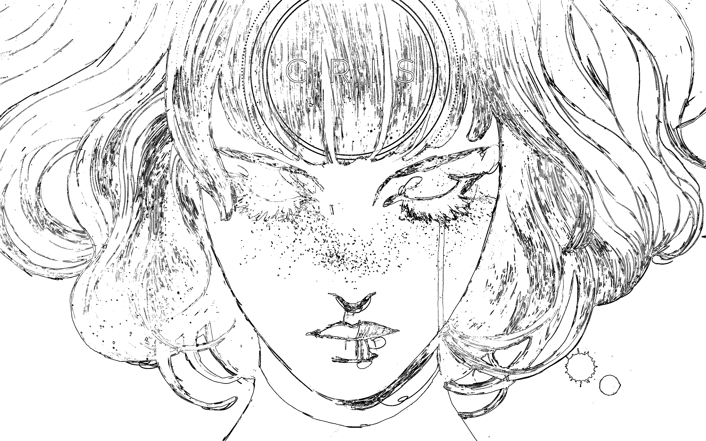

# Da sequenziale a parallelo :kick_scooter:

In questo esercizio dovrete rendere parallelo il codice del progetto *BordiSequenziale*.

BordiSequenziale è un software che legge un'immagine PNG e produce una versione bianco e nera dell'immagine dove in nero ci sono i vari bordi dell'immagine e in bianco il resto.

Immagine di esempio input:

Immagine in output

Per capire se un pixel è un bordo o meno, vengono presi i suoi 8 pixel vicini e calcolata la distanza tra il suo colore e il loro; queste distanze poi vengono sommate tutte tra loro e se superano un certo valore di soglia allora il pixel è considerato un bordo e quindi è colorato di nero nella nuova immagine, altrimenti è colorato di bianco. Un pixel quindi per sapere se è un bordo ha solo bisogno di conoscere i suoi vicini della **vecchia** immagine; questo implica che questo lavoro può essere eseguito da diversi thread in cui ogni thread si occupa di una sola "zona" dell'immagine. Per parallelizzare, create due thread che si occupano di due zone diverse dell'immagine; potete dividere l'immagine in sopra/sotto o sinistra/destra, scegliete voi.

BordiSequenziale quando finisce la sua esecuzione stampa su console il suo tempo di esecuzione. Fate in modo che anche la sua versione parallela lo faccia in modo da poter confrontare i tempi di esecuzione e vedere quanto è migliorato.

## Lavorare con le immagini PNG

Un'immagine PNG non è altro che una matrice di pixel, questi sono caratterizzati da 4 valori e cioè: il canale del rosso, il canale del verde, il canale del blu e la trasparenza. Questi 3 canali sono interi che possono avere valori da 0 a 255. Per i 3 canali colore questo valore rappresenta quanto è forte quel canale in quel determinato pixel, combinando questi valori otteniamo praticamente tutti i colori dello specchio visivo, abbiamo a disposizione **16.777.216 possibili combinazioni**.

Per quanto riguarda il posizionamento dei pixel, essendo dei punti in uno spazio bidimensionale la loro rappresentazione utlizza come sistema di coordinate quello del piano cartesiano e quindi un punto è caratterizzato da una X e una Y che ne determinano la sua posizione nell'immagine. C'è però una differenza rispetto al piano cartesiano, mentre in quest'ultimo l'origine (il punto (0,0)) si trova in basso a sinistra, qui l'origine è in alto a sinistra e la Y cresce verso il basso (è invertita).

Si può realizzare l'esercizio anche senza queste nozioni sulle immmagini :wink:

## Accompagnamento musicale :musical_note:
