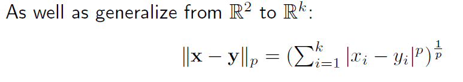

# Gutemberg analyzer :motor_scooter:

In questo programma dovrete analizzare dei classici di narrativa (in italiano o inglese) presi da [project Gutenberg](https://www.gutenberg.org/) 

Per ogni libro bisognerà produrre un array di interi di lunghezza 26 dove nella prima posizione ci sono il numero di lettere 'A' che compaiono nel libro (sia maiuscole che miniscole), nella seconda le 'B' e via discorrendo. Ignorate le lettere accentate, simboli di punteggiatura, numeri e altri simboli strani. Questa tipo di analisi è banalmente parallelizzabile, scrivete quindi questa parte di codice in modo da sfruttare il parallelismo scegliendo il modo più consono.

I file dei libri li trovate dentro la cartella books.

Una volta che avrete prodotto questi array per ogni libro, dovrete per ognuno di essi calcolare la distanza con tutti gli altri. Il concetto di distanza **come tutti ben sappiamo** è definito per punti in spazi 2D e in spazi 3D, non tutti sanno però che quel concetto è anche ben definito per qualsiasi dimensione, come la dimensione 26! Per calcolare la distanza esiste questa formula generica per ogni dimensione:

Una volta che avete calcolato la distanza di ogni libro verso tutti gli altri libri, per ognuno di essi calcolate la classifica dei primi 5 libri più vicini escluso se stesso.

Bonus: :motorcycle:

Fate in modo che il programma calcoli le classifiche nella zona di codice che gira in parallelo.